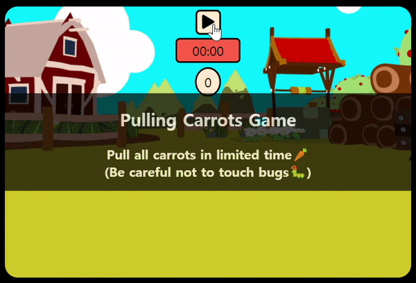

# Pulling Carrots Game (With Moving Bugs 🐛)

정해진 시간 내에 움직이는 벌레들을 피해 모든 당근을 뽑으면 이기는 게임 
기존에 구현했던 [당근 뽑기 게임](https://github.com/hyunji-lee-dev/pulling-carrots-game)을 응용하여 기능 추가
|데스크탑|모바일|
|:--:|:--:|
|||

## 게임 해보기 👉 [Live Demo](https://hyunji-lee-dev.github.io/pulling-carrots-game-canvas/)

### 진행방법

1. ▶ 버튼을 클릭해 게임을 시작한다. (중단하려면 ⏹ 버튼 클릭)
2. 당근을 클릭해서 뽑는다. 모든 당근이 뽑히면 승리🎉
3. 벌레를 클릭하거나, 제한시간이 지나면 패배☠
4. 게임결과 창에서 리플레이 버튼이나 종료 버튼을 클릭한다.

## 실습목적

- Canvas API 활용
- 오브젝트의 prototype-based 상속 활용

## 사용기술

- HTML
- CSS
- JavaScript
- Web APIs

## 구현사항

### 랜덤한 방향과 속도로 움직이는 벌레들

- Canvas API와 requestAnimationFrame() 사용

### Creature 오브젝트를 Carrot과 Bug가 상속

- 당근들과 벌레들을 랜덤한 위치에 배치 (draw 함수)
- 아이템들의 클릭 감지 (detectClick 함수)

## 참고자료

- [드림코딩 아카데미](https://academy.dream-coding.com)
- MDN Web Docs
